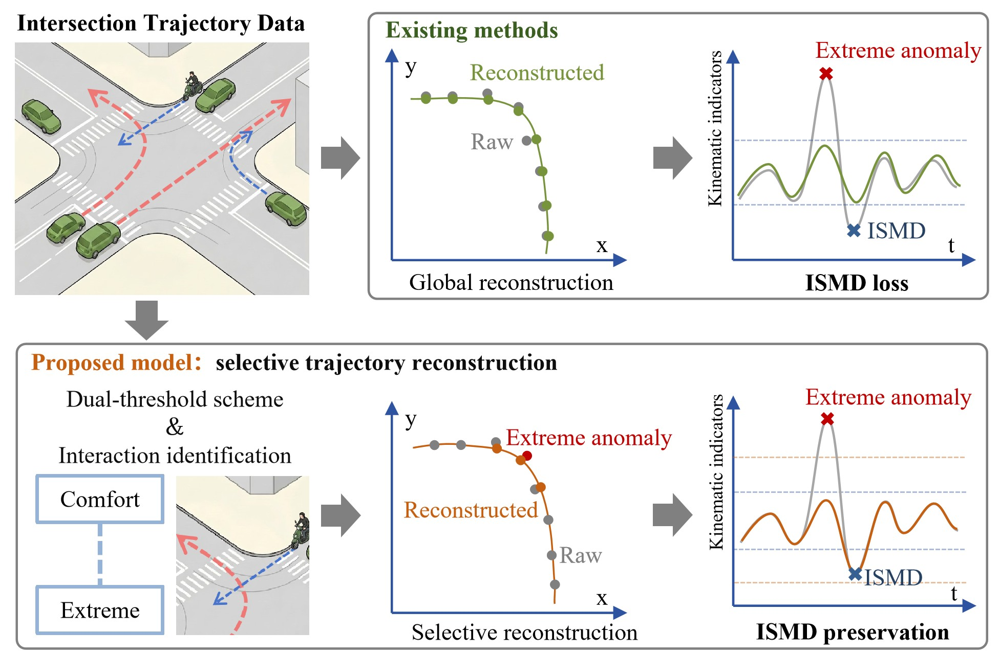

# Selective Trajectory Reconstruction with Interaction-Supported Moderate Deviation (ISMD) Preservation

<p align="center">
  
</p>

## Overview

Vehicle trajectory data provide an important basis for traffic research such as driving behavior analysis and conflict identification. However, raw trajectory data collected from sensing systems are often affected by detection and tracking errors, making it difficult to distinguish measurement-induced anomalies from **interaction-supported moderate deviations (ISMD)**.

This study proposes a **selective constrained optimization model** for trajectory reconstruction. It integrates a dual-threshold scheme with spatiotemporal neighborhood-based interaction identification, and develops a locally constrained reconstruction strategy with heterogeneous weight allocation, ISMD-point protection, causative-indicator preservation, and hierarchical fallback solving.

The model was validated using **24 h** of roadside perception data from an intersection in the Beijing High-level Automated Driving Demonstration Area, covering **13,487** vehicle trajectories and **1,737,147** sampled points. It achieves a mean Euclidean distance of **0.04 m**, a mean closeness rate of **90.78%**, and an ISMD preservation rate of **93.25%**.

## Project Page

The interactive project page — including dynamic comparisons and the full multi-model performance summary — is hosted via GitHub Pages:

🔗 **https://transmindbjut.github.io/Trajectory_Reconstruction/**

## Repository Structure

```
.
├── docs/                          # GitHub Pages site (served from /docs)
│   ├── index.html                 # Project homepage
│   └── static/
│       ├── css/style.css          # Stylesheet
│       ├── images/                # Figures (fig1, fig2, fig10, fig11) + icons
│       └── videos/                # Dynamic comparison demos (intersection, proximity)
├── code/
│   └── make_intersection_gif.py   # Script that generates the animation demos
├── Multi-model_trajectory_reconstruction_results.xlsx  # Performance table source
└── README.md
```

## Authors

Shaobin Yang¹, Pengfei Cui¹\*, Lei Han²\*, Lishan Sun¹, Yang Yang³, Xingchen Zhang¹

¹ Beijing University of Technology · ² University of Central Florida · ³ Beijing Jiaotong University

\* Corresponding authors

## Data Availability

The authors do not have permission to share the raw trajectory data. This repository therefore contains only the project page, figures, and the visualization script.

## Citation

*To be added upon publication.*
